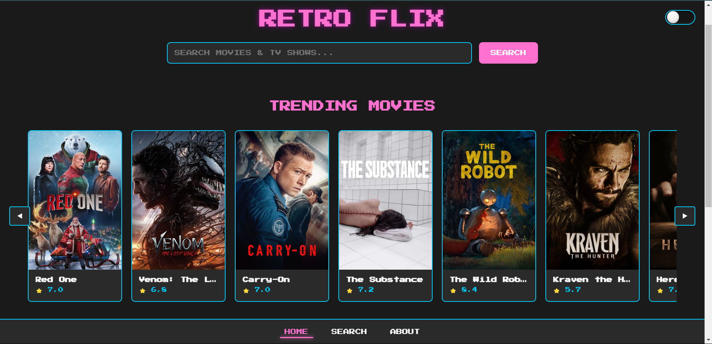
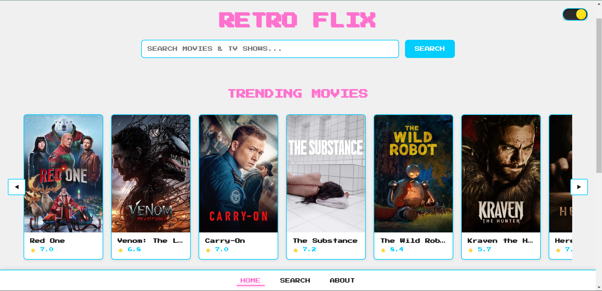
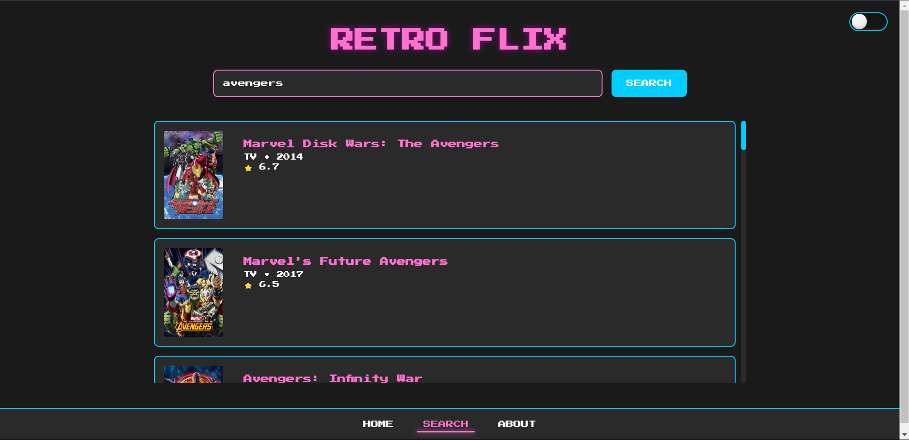

# Retro Flix

## Overview

Retro Flix is a retro-themed movie download website with an engaging dark and light theme toggle. It allows users to search for movies and download them conveniently. The project is built using Flask as the backend, HTML, JavaScript for the frontend, and MongoDB as the database. The themes and features are shown in the provided screenshots.

## Features

- **Retro Theme**: Includes both dark and light mode toggle for an immersive retro experience.
- **Search Functionality**: Users can search for movies using the integrated search bar.
- **Movie Downloads**: Direct download links for movies.
- **Responsive Design**: Optimized for various devices.

## Tech Stack

- **Backend**: Flask
- **Frontend**: HTML, CSS, JavaScript
- **Database**: MongoDB
- **Environment Variables Management**: python-dotenv
- **API Integration**: Used for fetching movie data.

## Setup Instructions

1. Clone the repository:
   ```bash
   git clone https://github.com/yourusername/retro_flix.git
   ```
2. Navigate to the project directory:
   ```bash
   cd retro_flix
   ```
3. Create a virtual environment and activate it:
   ```bash
   python -m venv env
   source env/bin/activate  # On Windows, use `env\Scripts\activate`
   ```
4. Install the required dependencies:
   ```bash
   pip install -r requirements.txt
   ```
5. Set up environment variables:
   - Create a `.env` file in the project root.
   - Add the following variables:
     ```env
     MONGO_URI=your_mongo_database_uri
     API_KEY=your_api_key_for_movie_data
     ```
6. Run the application:
   ```bash
   flask run
   ```
7. Open your browser and navigate to `http://127.0.0.1:5000`.

## Screenshots

### Dark Theme


### Light Theme


### Search Feature


## Dependencies

A `requirements.txt` file is included for managing dependencies. Below is the generated content for `requirements.txt`:

```txt
Flask
flask-cors
pymongo
humanize
dotenv
requests
```

## Contributing

Contributions are welcome! Please fork the repository, make your changes, and create a pull request.

## License

This project is licensed under the MIT License. See the `LICENSE` file for details.
